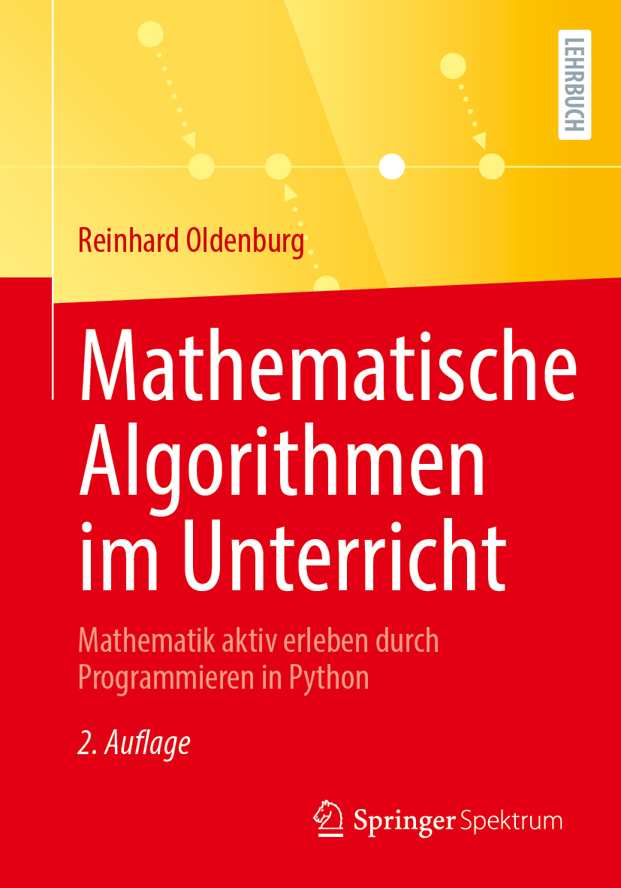

# MatheAlgosUnterricht
Dies ist eine Sammlung von Python-Programmen und Jupyter-Notebooks als Ergänzung zum Buch [Mathematische Algorithmen im Unterricht, 2. Aufl.](https://link.springer.com/book/9783658517083) von Reinhard Oldenburg (Springer Spektrum, 2026).

